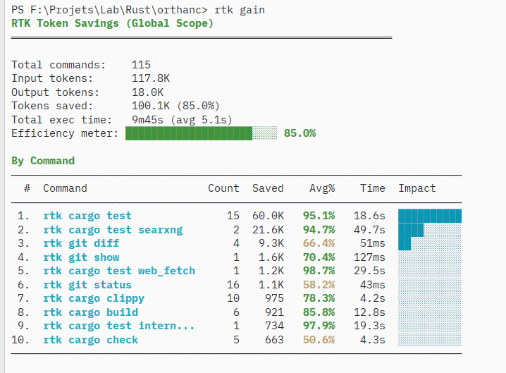

# @_Akanoa_ — Noa 🦀

> - Pratique la vulgarisation graphique en dilettante. 🗣🖍👂

- Vous pouvez retrouver mes anciens articles ici http://lafor.ge 📖

- Streamer erratique  
> Followers: 2.7K. Verified: no.

---

## Thread (10 tweets)

**[1/10]** Un collègue vient de me faire découvrir ça 
https://github.com/rtk-ai/rtk

---

**[2/10]** @hanxhx_ je vais le mettre dans Orthanc on verra bien ^^

---

**[3/10]** @SylvainLegland amusant je me fabrique un système similaire mais je suis bcp moins avancé :D
https://gitlab.com/Akanoa/orthanc

---

**[4/10]** @FlorentinDUBOIS ça a la côte en tout cas :D

---

**[5/10]** @YoussefMrini tu as vue de vrais différences notables sur ton pool de tokens ?

---

**[6/10]** @Sk_0x7 je me sens bête de pas l'avoir trouvé plus tôt ^^'

---

**[7/10]** @0xSushaya je ne l'ai utilisé que 3h cette nuit. ça m'a semblé plutôt cohérent.
surtout pour mes cargo test, là j'ai vraiment vu une différence notable.
qu'est ce que tu as remarqué comme données qio s'évaporent en passant dans le proxy ?

---

**[8/10]** @MoodiSadi happy to help sharing good stuff ^^

---

**[9/10]** @nuvolore as I can understand, stripping unrelevant formatting.

---

**[10/10]** @aussetg à la louche à une chariotte de bouse près, les sessions sembblent durer 3 fois plus longtemps avant compaction.

---

*Captured: 2026-03-01T05:28:40.932Z*  
*Source: https://x.com/_Akanoa_/status/2027431590377181606*
