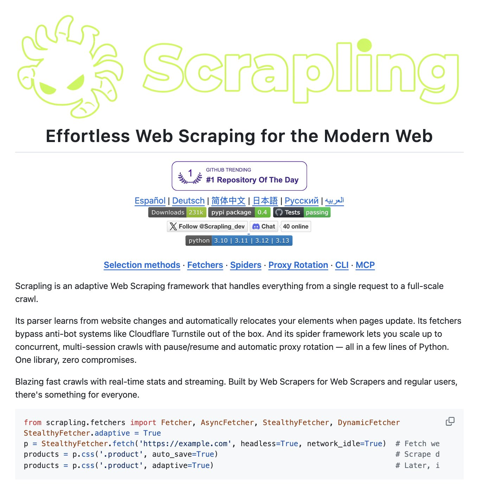
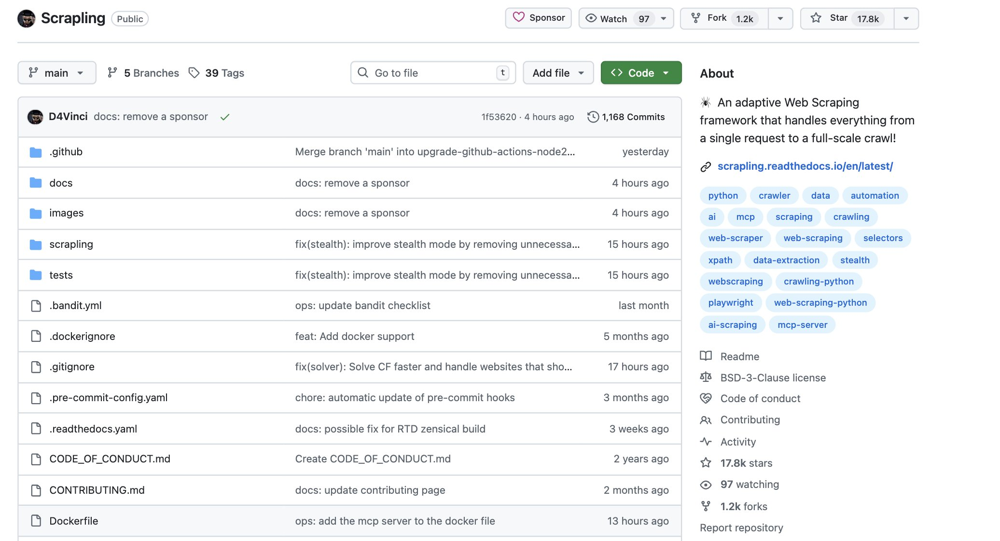

# @simplifyinAI — Simplifying AI

> Helping you master AI daily with step-by-step AI guides, latest news & practical tools  
> Followers: 14.6K. Verified: no.

---

## Thread (2 tweets)

**[1/2]** OpenClaw just got an unfair advantage over every other AI agent 🤯

It can now use Scrapling to scrape any website without getting blocked by Cloudflare. You don't need to maintain selectors when websites update their structure.

- 774x faster than BeautifulSoup.
- Zero bot detection.
- Bypasses ALL Cloudflare protections natively

100% Open Source.

---

**[2/2]** Paper: https://github.com/D4Vinci/Scrapling

If you want more practical AI gems and use cases, join our free newsletter with daily tutorials and latest news in AI: http://simplifyingai.co

---

*Captured: 2026-03-01T06:03:38.686Z*  
*Source: https://x.com/simplifyinAI/status/2027439397449437288*
