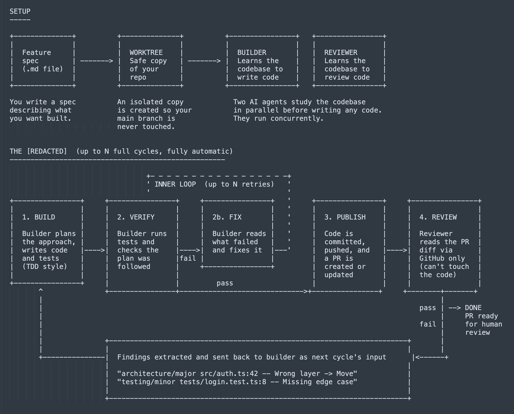
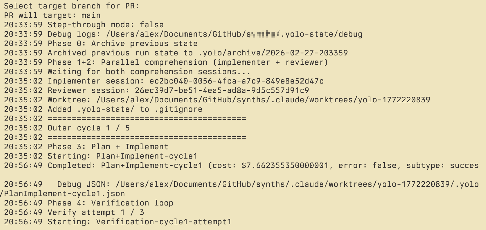

# @alxfazio — alex fazio

> code & clankers • nvim btw  
> Followers: 16.7K. Verified: no.

---

my claude flow is so battle-tested that half the time i catch myself just hitting yes/no/enter, so i built myself a ralph that doesn’t suck. it follows swe best practices with quality gates (e.g., plankton), adopts best-in-class context engineering practices, and can handle complex codebases, with stacked prs and multiple rounds of pr review. article and repo soon. spoiler, it's all claude -p

---

*Captured: 2026-03-01T05:27:15.567Z*  
*Source: https://x.com/alxfazio/status/2027473676690665745*
