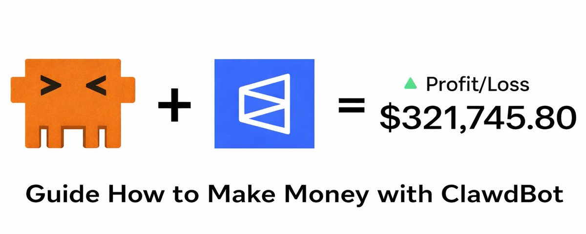
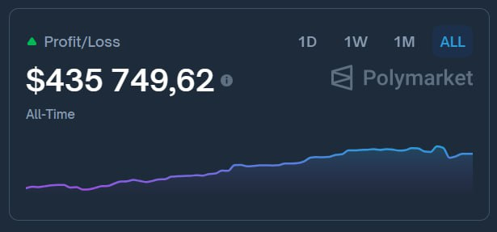
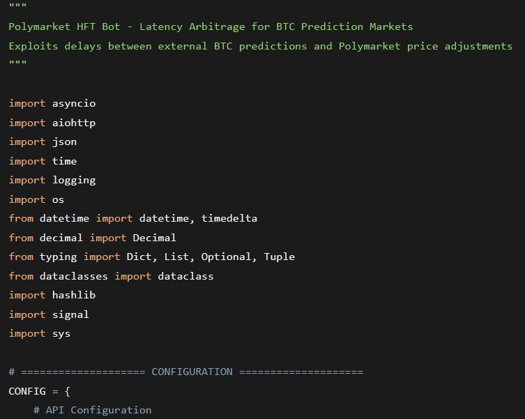

# @seelffff — self.dll

> web3 developer | @Polymarket believer  
> Followers: 1.7K. Verified: no.

---

one Polymarket account quietly turned $50 into $435,000

no one talked about it

i reverse‑engineered it and asked Claude to build a similar bot using the same strategy

one prompt, 40 minutes, done

polymarket updates BTC contract prices slower than real price feeds

→ the bot pulls BTC predictions from TradingView + CryptoQuant

→ catches the moment when Polymarket lags by >0.3%

→ executes in <100ms before the market catches up

→ 1000+ orders per second, 0.3-0.8% per trade

risk: 0.5% per trade, 2% daily cap

it brings in $400‑700/day

runs locally no cloud, no GPU

written in Rust

how long do you think the bot era will last?

> **Note:** This tweet contains a video — not captured. View at source URL.

---

> **Quoting @w1nklerr:**
> http://x.com/i/article/2018378210413613057
>
> 
> 
> 

---

*Captured: 2026-03-01T05:31:02.075Z*  
*Source: https://x.com/seelffff/status/2027498003028955206*
