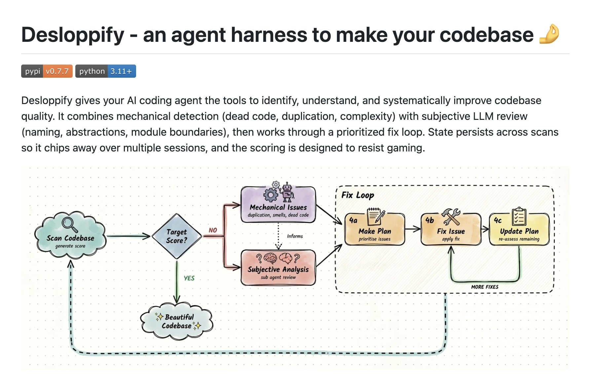

# @peteromallet — POM

> Open Source AI Art @banodoco | Tools for creativity @Reigh_Art | 👫🐕 @hannahsubmarine  
> Followers: 15.4K. Verified: no.

---

## Thread (5 tweets)

**[1/5]** Introducing Desloppify v.0.8.

Thanks to many workflow improvements + new agent planning tools, it can now run for days on end - autonomously finding, understanding, & fixing large and small code quality problems.

There's no reason your slop code can't be beautiful!

---

**[2/5]** Link: https://github.com/peteromallet/desloppify

---

**[3/5]** @elipzy :(

---

**[4/5]** @darin_gordon I don't know what that is but haven't been impressed by claude's agentic tooling generally. Great model w/ mediocre tooling imo

---

**[5/5]** @nephel_ I have used extensively with both!

---

*Captured: 2026-03-01T05:01:11.593Z*  
*Source: https://x.com/peteromallet/status/2027519673508511768*
