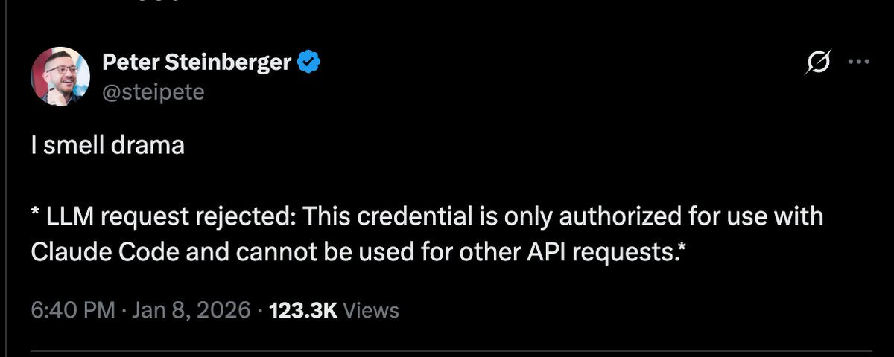
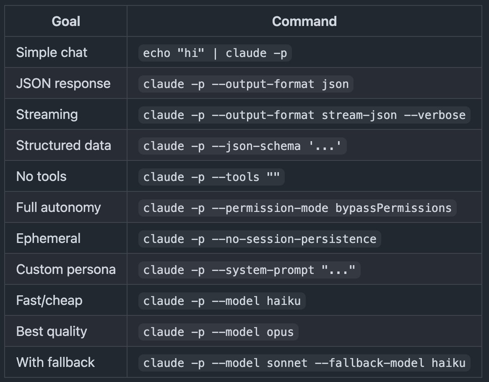
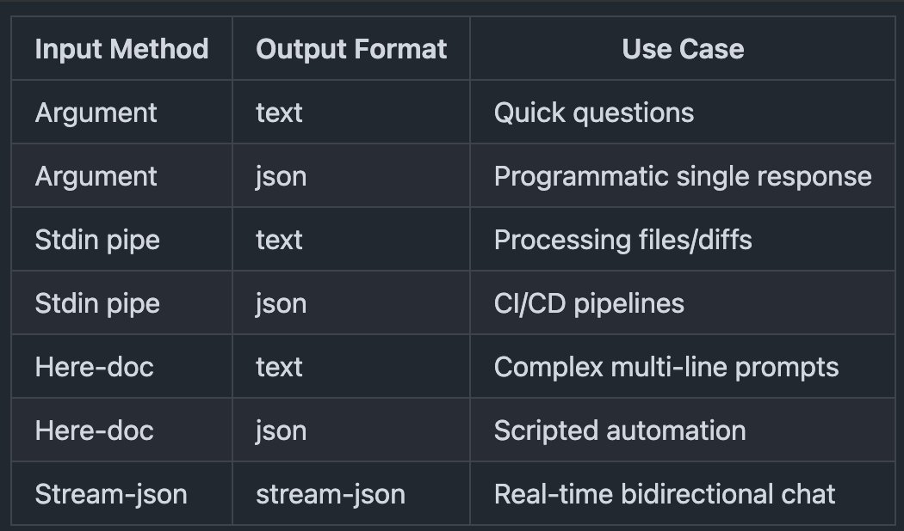
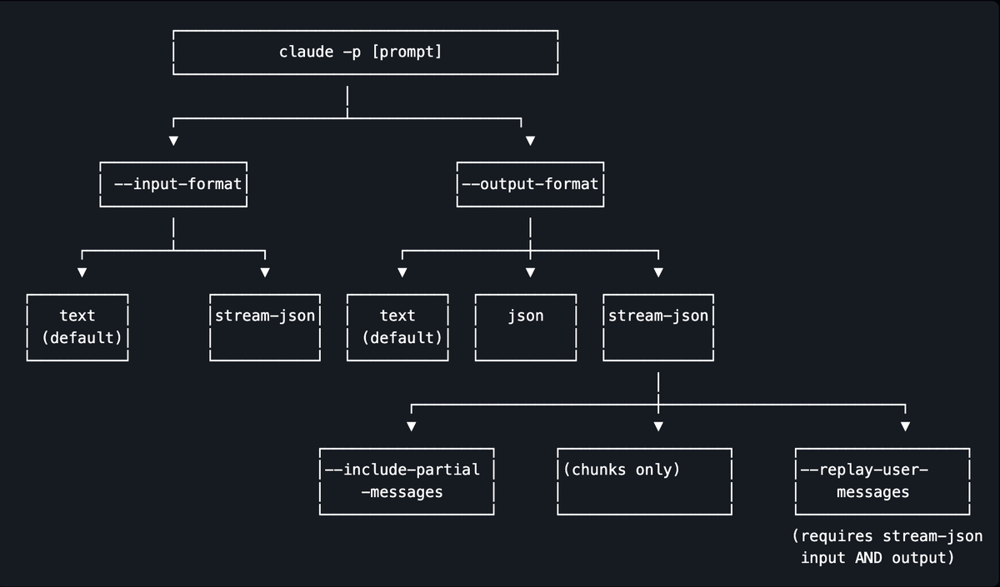
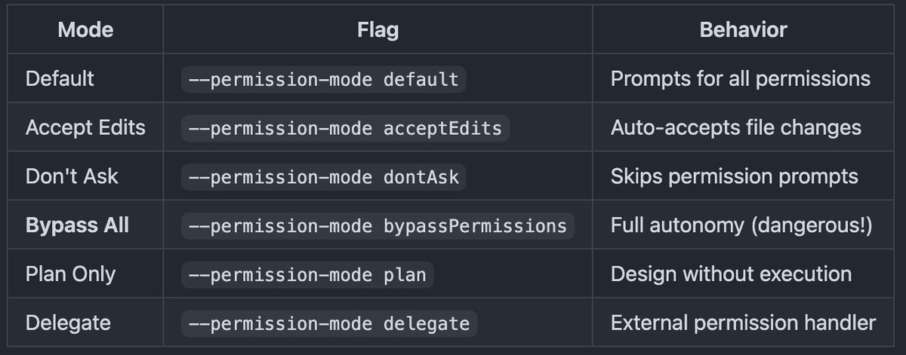
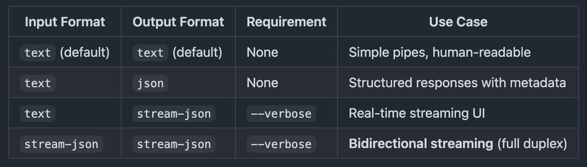

# @alxfazio — alex fazio

> code & clankers • nvim btw  
> Followers: 16.7K. Verified: no.

---

you should be headless claude maxxing, so here’s an article that explains it better than the anthropic docs

---

> **Quoting @dhasandev:**
> http://x.com/i/article/2009497314013138947
>
> 
> 
> 
> 
> 
> 

---

*Captured: 2026-03-01T05:29:02.471Z*  
*Source: https://x.com/alxfazio/status/2027532563544228013*
