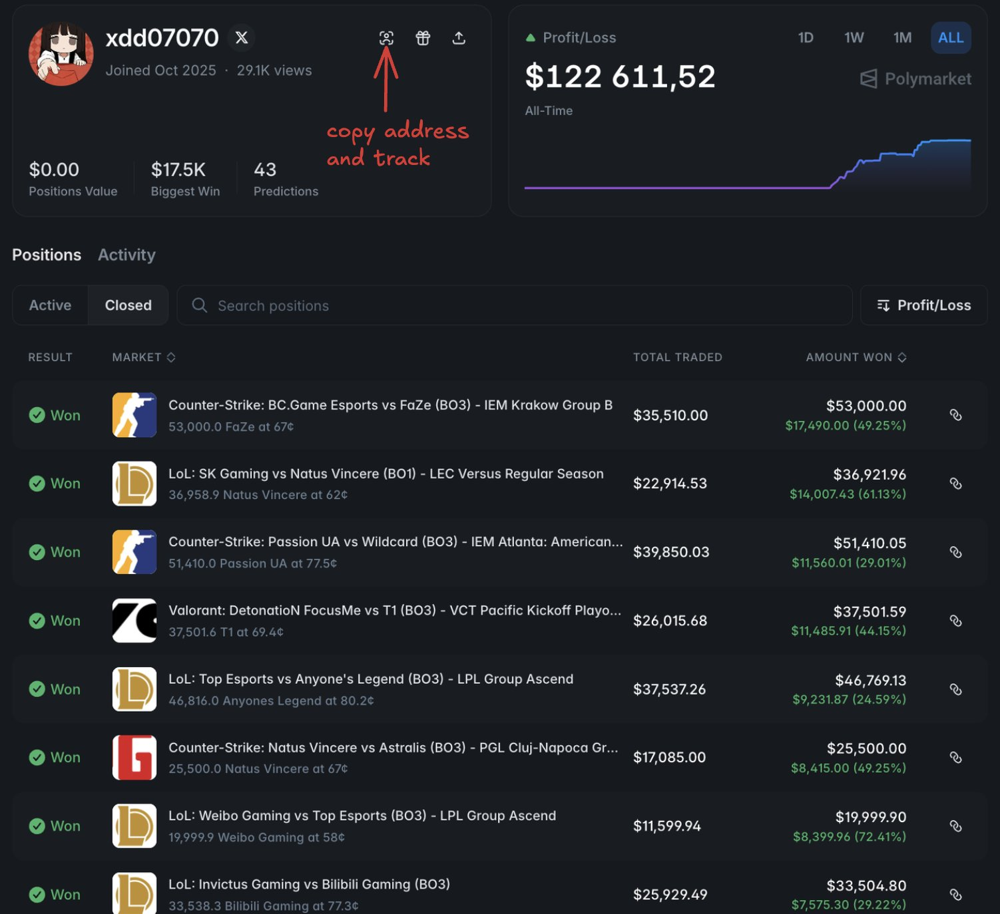
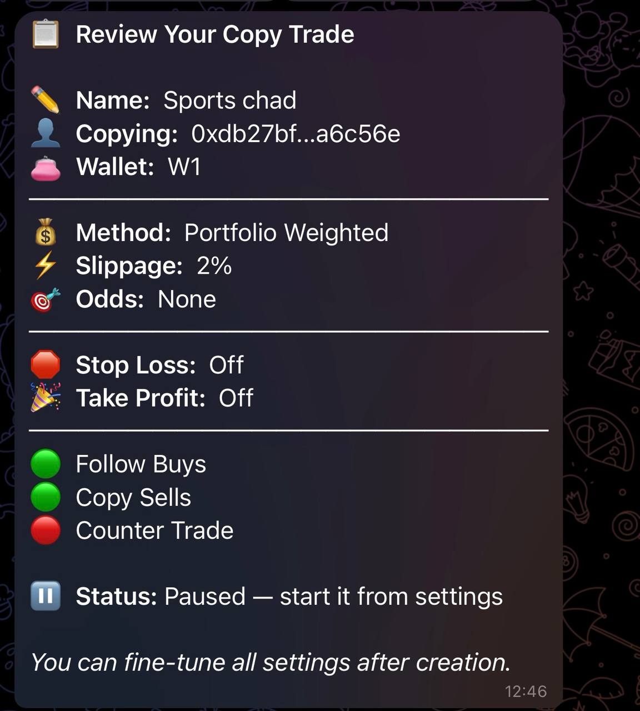

# @Kropanchik — Gorynich☄️

> @Polymarket & @MeteoraAG enjoyer  
> Followers: 1.5K. Verified: no.

---

A practical guide to finding wallets worth copying on Polymarket

Most people pick wallets based on the biggest PnL number they see. That's the wrong move

Here's how to actually filter:

> Go to http://polymarketanalytics.com -> Traders -> Filters
> Set PnL: $15K-$400K, win rate 70%+, 20+ total trades, 2+ active positions
> Ignore anything with hundreds of trades per day - spread bot, you won't catch the entries

What you're looking for:

> 2-3 months of consistent results, not one lucky spike
> Specialist in 1–2 niches - politics, sports, weather - not everything
> Clean drawdown curve - how they lose matters as much as how they win

Wallets to skip immediately:

> 99% win rate with 50+ trades per day = spread farmer
> One huge win then silence = one-event insider with no repeatable edge
> Tiny markets = you become their exit liquidity

Once you have the wallet, speed is everything

The more people copying the same trader, the worse your entry - https://t.me/KreoPolyBot?start=ref-kropanchik

One wallet worth watching right now:
0x25e28169faea17421fcd4cc361f6436d1e449a09

90% win rate, CS:GO and LoL only, doubled balance in one month

---

> **Quoting @Kropanchik:**
> Probably the best wallet to copy on prediction markets for sports - and it's not even close
> 
> DrPufferfish. Joined May 2025. $5.9M all-time profit. 1,222 predictions. 80%+ win rate
> 
> $918K on a single prediction. One bet, one game, nearly a million dollars - while most traders were celebrating a $500 night
> 
> He's been doing this since May - quietly, ruthlessly, while everyone else was burning money trying to predict politics and macro events
> 
> The painful part? Every position is public. You don't need to analyze anything. You don't need to read the news. You just need to be watching the right wallet at the right time
> 
> That's exactly what copytrading does - the moment DrPufferfish opens a position, you copy it automatically before the odds shift. Started copying him via Kreo [https://t.me/KreoPolyBot?start=ref-kropanchik]
> 
> His wallet: 0xdb27bf2ac5d428a9c63dbc914611036855a6c56e
> 
> $5.9M in profit. Already made. Yours to follow
> 
> The guide how to copy and my settings attached
>
> 

---

*Captured: 2026-03-01T06:04:43.828Z*  
*Source: https://x.com/Kropanchik/status/2027652011437474053*
