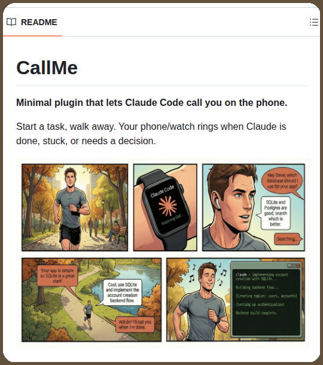

# @tom_doerr — Tom Dörr

> Follow for posts about GitHub repos, DSPy, and agents
Subscribe for top posts
DM to share your AI project (Due to volume of DMs I'll prioritize subscribers)  
> Followers: 178.8K. Verified: no.

---

Claude Code calls the phone when tasks finish

https://github.com/ZeframLou/call-me

---

*Captured: 2026-03-01T15:38:08.663Z*  
*Source: https://x.com/tom_doerr/status/2027668677248668048*
