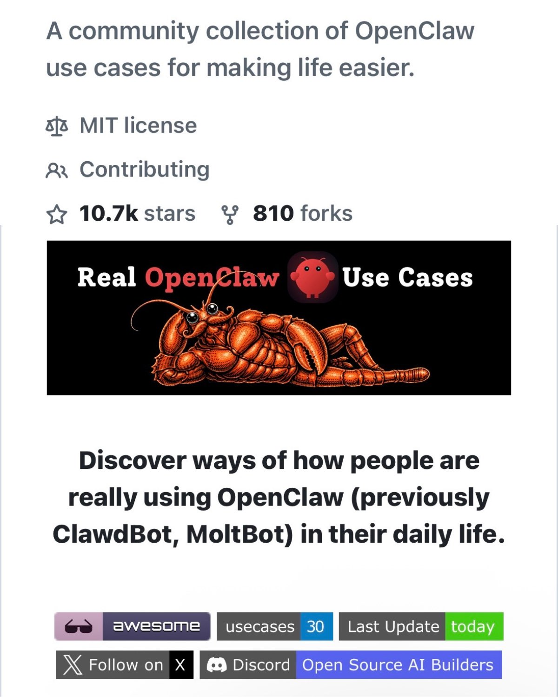

# @hananyss — Hananyss

> Thinking @virtuals_io | investment /TVL growth | prev investing @outlierventures @deloitte_ventures @gatesfoundation  
> Followers: 7.1K. Verified: no.

---

My claw bot has installed so many skills from this repo. Truly the most fun I’ve had in months!

---

> **Quoting @Hesamation:**
> holy shit… woke up today to see the OpenClaw usecases repo has now over 11K stars ⭐️.
> 
> this is a signal that people are dying to find ways of using @openclaw to make their life easier. we already have 30 examples and the list is growing as more people open PRs.
> 
> if you’re curious: https://github.com/hesamsheikh/awesome-openclaw-usecases
> 
> I started the repo as I was genuinely curious about what are some ways to use OpenClaw. seemed like there are 1000s of skills (most malicious :) but not so many ideas.
> 
> if you find one you like, make sure to star the repo, otherwise share new use cases we might have missed.
>
> 

---

*Captured: 2026-03-01T05:15:59.293Z*  
*Source: https://x.com/hananyss/status/2027677636147704118*
