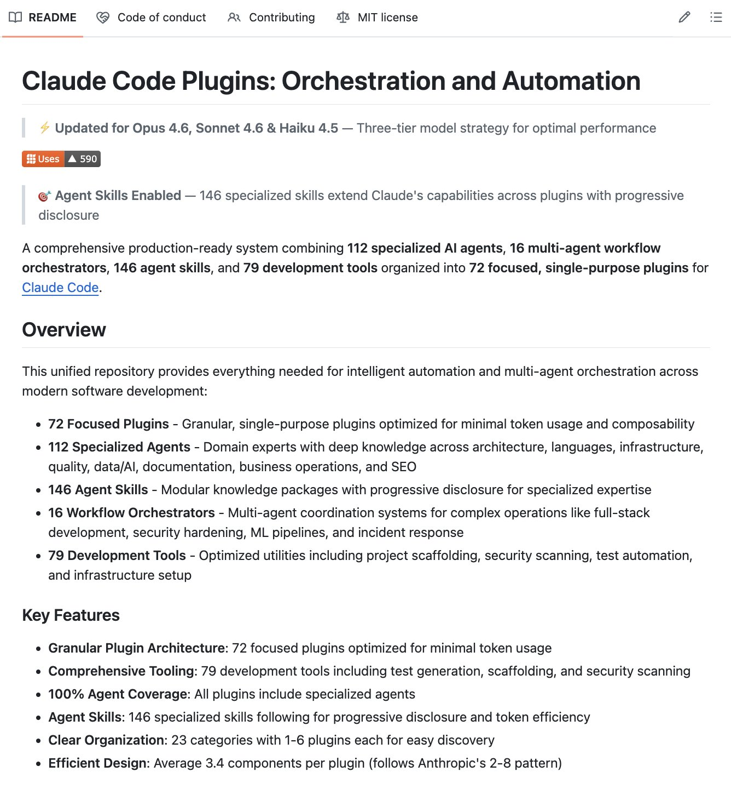

# @aiwithmayank — Mayank Vora

> AI doesn’t have to be complicated - I’m here to show you how to actually use it and break down the latest trends in AI and Tech.  
> Followers: 6.6K. Verified: no.

---

## Thread (3 tweets)

**[1/3]** Holy shit… 100+ specialized Claude Code subagents just dropped with a single install script.

Research analysts, competitive intelligence agents, workflow orchestrators  each with its own isolated context window.

One command and you have an entire AI team.

100% open-source. MIT license.

---

**[2/3]** Link: https://github.com/wshobson/agents

---

**[3/3]** AI is not going to take job..

Our newsletter, The Shift, delivers breakthroughs, tools, and strategies to help you become value creator and build in this new era easily.

Subscribe: https://theshiftai.beehiiv.com/subscribe

Plus: Get access to 3k+ AI Tools and free AI courses when you join.

---

*Captured: 2026-03-01T05:32:40.519Z*  
*Source: https://x.com/aiwithmayank/status/2027680408616493124*
