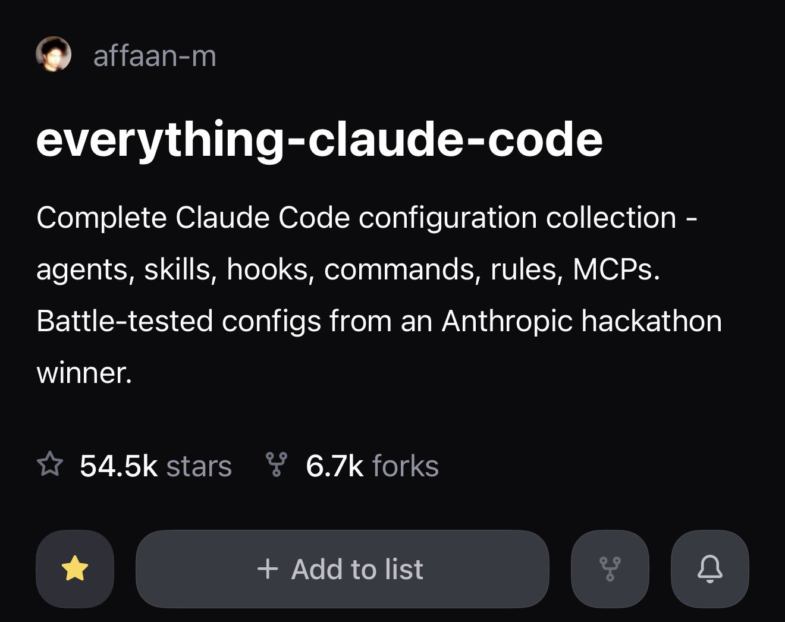

# @affaanmustafa — cogsec

> institutionalizing gambling @ito_markets = (Ω, 𝓕, ℙ_α); p = ℙ_α(e=1); y ∈ {0,1}; ∂p/∂α ＞ 0 | maximizing agent harness performance  - ECC (55k+ GH)  
> Followers: 19.3K. Verified: no.

---

> **Brady's note:** ?s=46

---

for anyone switching, moving over, or just getting started with claude

we have the most up to date and comprehensive repository to maximize your agent harness potential

maintained by me and the community

everything is succinctly explained in more detail in the guides below

---

*Captured: 2026-03-01T03:07:54.703Z*  
*Source: https://x.com/affaanmustafa/status/2027727596608479430*
