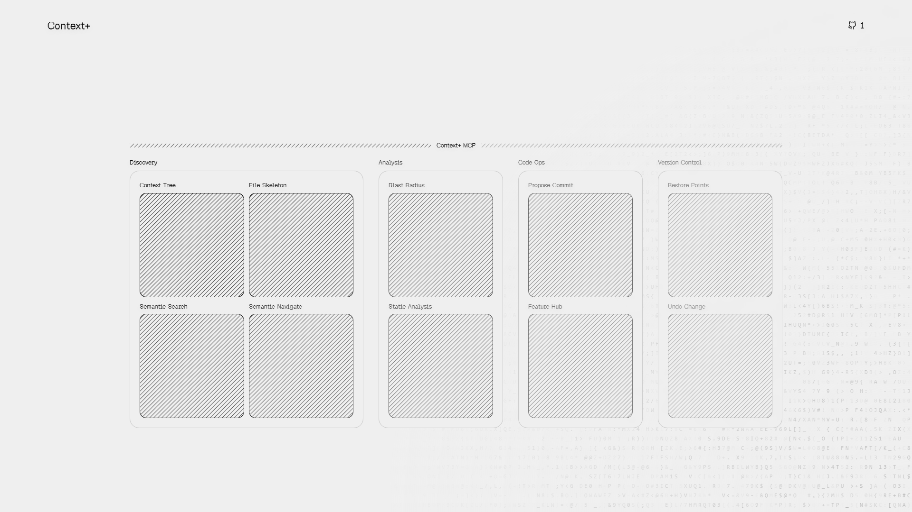
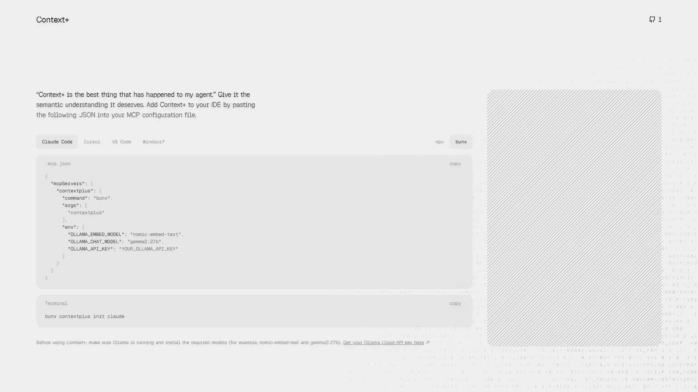
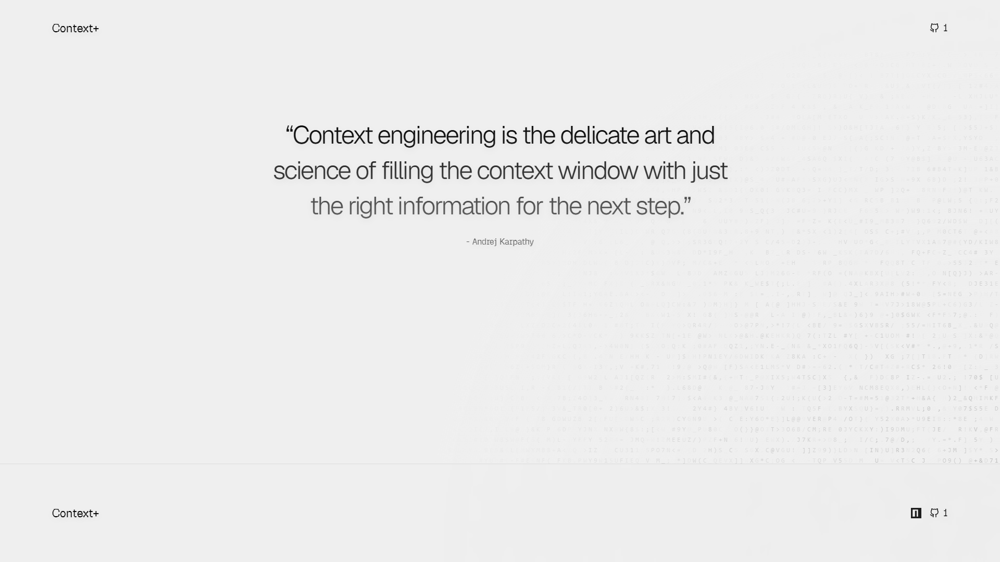

# @forloopcodes — forloop

> ts kt rs apps agents, bunx xdist, bunx contextplus init claude  
> Followers: 8.3K. Verified: no.

---

## Thread (3 tweets)

**[1/3]** design tweaks for context+

github: https://github.com/ForLoopCodes/contextplus
website: https://contextplus.vercel.app/

---

**[2/3]** @koushik_xd does the site really need one? i mean its just for the mcp and the main use is mcp so...

---

**[3/3]** @user_ops thanks:>

---

*Captured: 2026-03-01T05:26:59.180Z*  
*Source: https://x.com/forloopcodes/status/2027746562722705745*
