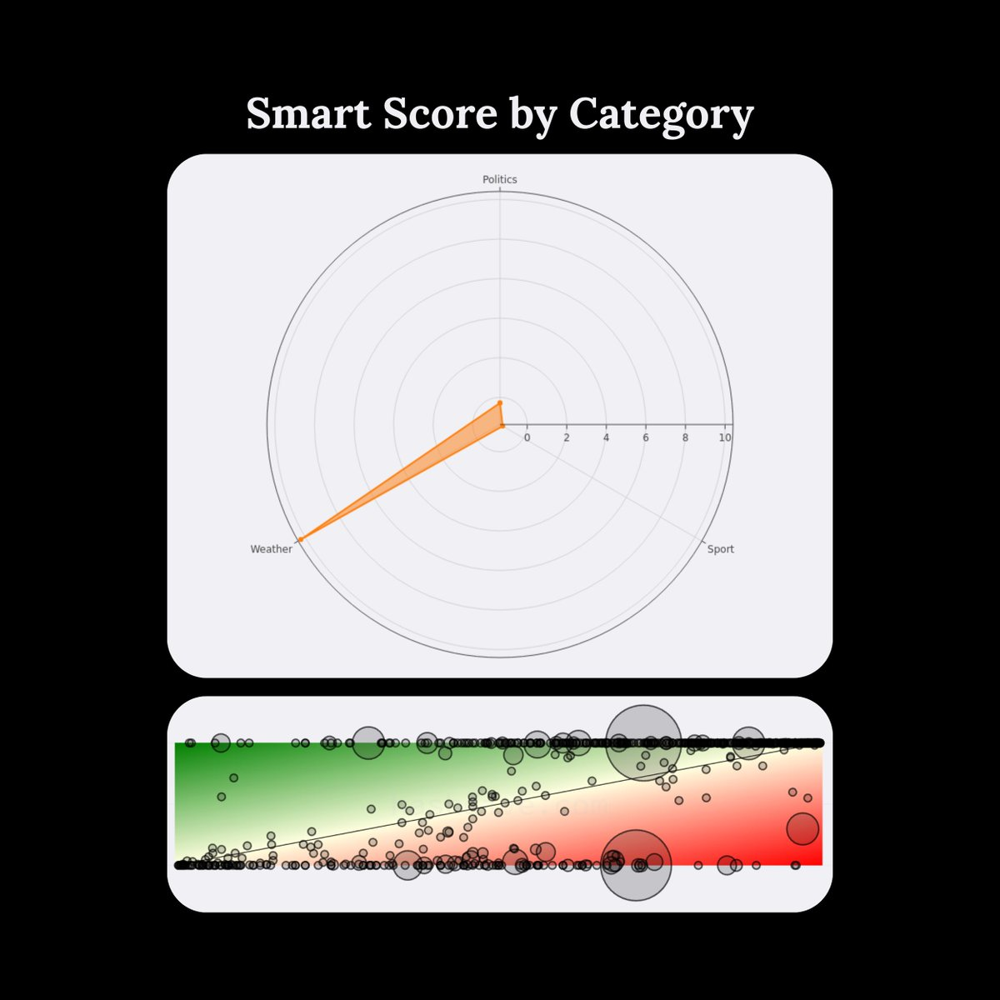
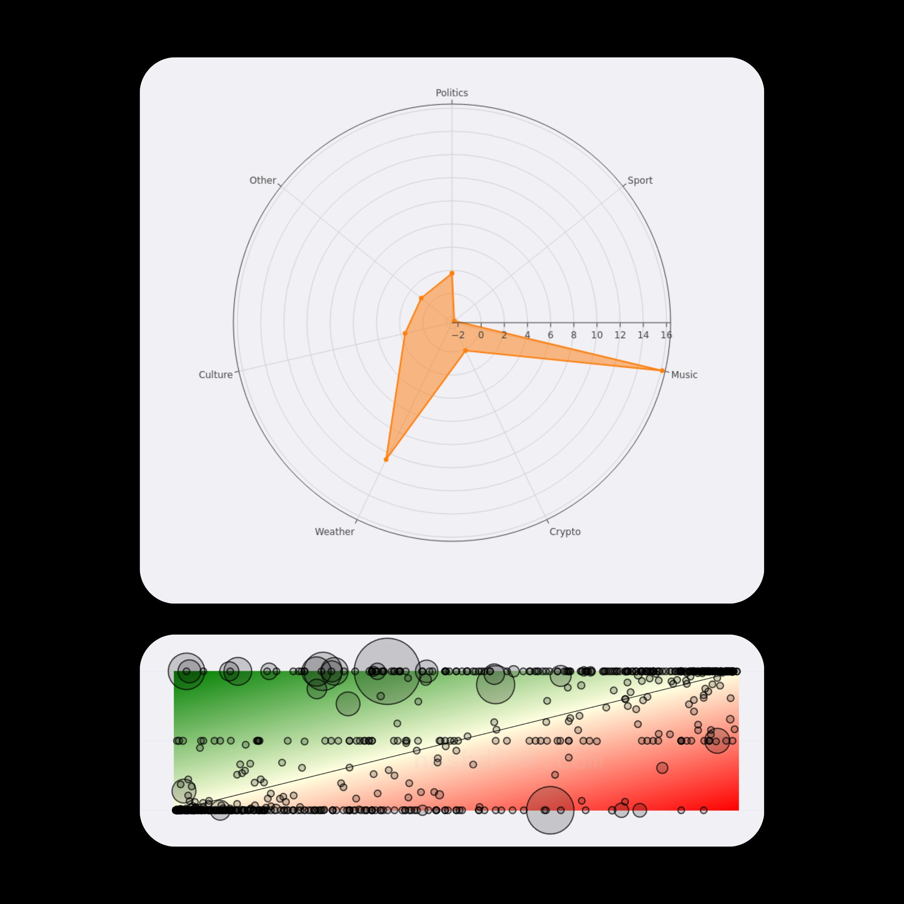

# @polydao — Mr. Buzzoni

> web3 degen • @polymarket maxi • sharing market alpha • CEO @polynternet

Everything here is paid promo. Yes, even the alpha. Especially the alpha  
> Followers: 5.7K. Verified: no.

---

AUTOMATED WEATHER ARBITRAGE IN ACTION

spent some time digging into Railbird - very clean, systematic profile

> +$14 509 PnL
> 73.8% win rate
> 2 258 positions
> $1.4K net deposits → ~$9K portfolio

~1000%+ ROI from a small base

97% of trades are Weather markets:

> mostly “No” on low-probability temperature buckets
> multiple adjacent ranges per city/day

he’s exploiting pricing inefficiencies in temperature buckets - classic probability arbitrage

on some days he fires dozens of $5-$25 orders within seconds:

> across cities
> across ranges
> often near $0.90-$1.00 on strong No

very likely automated

> wallet: 0x906f2454a777600aea6c506247566decef82371a

> can be copytraded via: http://kreo.app/@trade

(full breakdown + data in my TG in comments)

> **Note:** This tweet contains a video — not captured. View at source URL.

---

> **Quoting @polydao:**
> +$36K FROM TEMPERATURES 🛰️🌡️
> 
> meet 1-800-LIQUIDITY - one of the most consistent weather traders on @Polymarket
> 
> > core idea? - structured weather arbitrage with basket sizing
> 
> here’s the pattern:
> 
> > pulls detailed forecast data (likely ECMWF / NWS / pro APIs)
> > finds probability mismatches vs forecast
> > enters at 1¢-20¢ when edge is clear
> 
> but the real edge is the basket system!
> 
> > if forecast says ~11°C, he doesn’t take one position
> 
> he opens 3-6 adjacent ranges:
> 
> > 9°C
> > 10°C
> > 11°C
> > 12°C
> 
> yes - some legs go to zero
> > but the winning leg can return 200% to 7000%
> 
> then profits get recycled into the next set - that’s how you scale without fresh deposits!
> 
> and this isn’t theoretical:
> 
> > $36 991 total PnL
> > $33 000 from weather alone
> > 1 000+ positions executed
> 
> if you want to mirror this type of structured execution instead of reverse-engineering it manually
> 
> > profile: https://polymarket.com/0x584eee598b341109592b985c1a253ab044fa090f?via=polydao
> 
> > i'm copytrade here:
> https://t.me/KreoPolyBot?start=ref-trade
> 
> weather markets look boring...
> 
> > until you realize they’re some of the cleanest data-driven inefficiencies on the platform
>
> 

---

*Captured: 2026-03-01T05:18:55.159Z*  
*Source: https://x.com/polydao/status/2027753906932011235*
