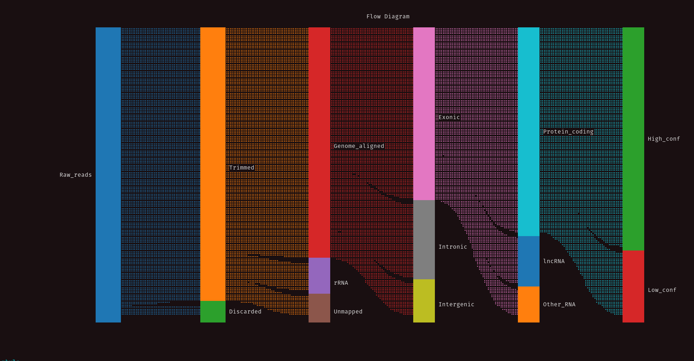
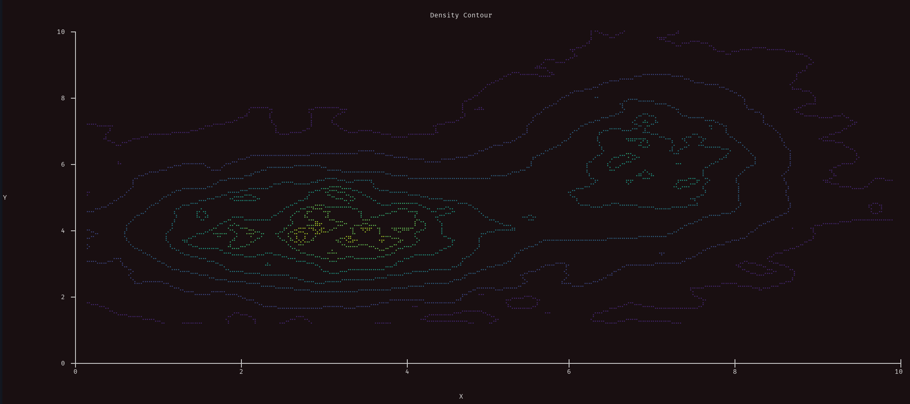
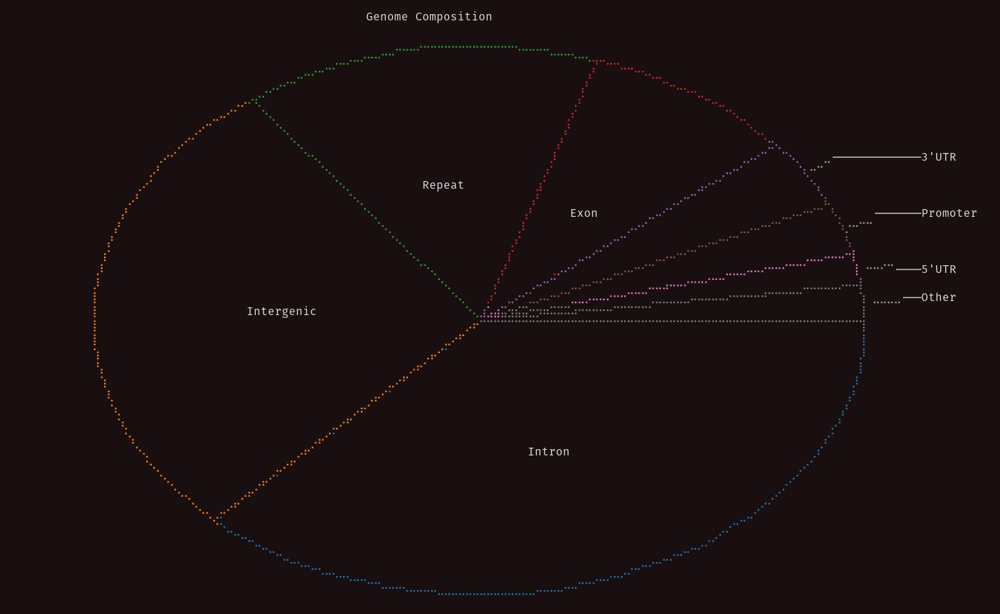
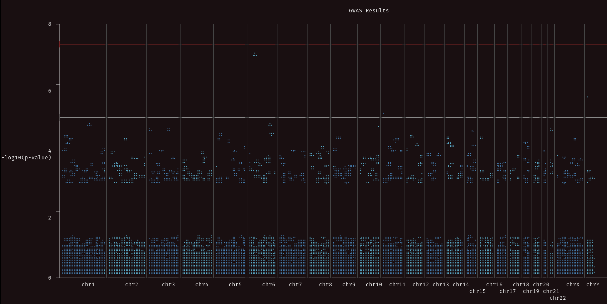

# @Psy_Fer_ — James Ferguson

> Bioinformatician/Genomics Software Engineer @GarvanInstitute, Views my own.
Mastodon @Psy_Fer_@genomic.social, https://genomic.social/
BS: http://psy-fer.bsky.social  
> Followers: 3.9K. Verified: no.

---

Introducing kuva: A scientific plotting library in rust, along with cli binary with the option to plot directly into the terminal.

Feel free to drop me some feedback as an issue on the repo

https://github.com/Psy-Fer/kuva

https://crates.io/crates/kuva/0.1.1

---

> **Quoting @Psy_Fer_:**
> Yea your plotting library is cool, but can it do this?
> 
> (yes, that's plotting in the terminal, with just ascii, utf-8, and ansi)
>
> 
> 
> 
> 

---

*Captured: 2026-03-01T05:20:27.927Z*  
*Source: https://x.com/Psy_Fer_/status/2027905785322475750*
