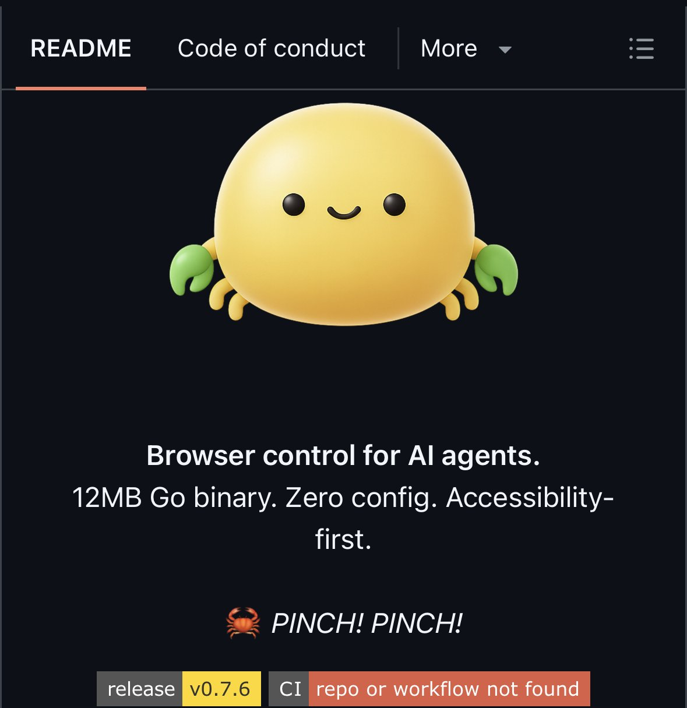

# @GithubProjects — GitHub Projects Community

> We're sharing/showcasing best of @github projects/repos. Follow to stay in loop. Promoting Open-Source Contributions. UNOFFICIAL, but followed by github  
> Followers: 301.7K. Verified: no.

---

> **Brady's note:** ?s=46

---

## Thread (2 tweets)

**[1/2]** High-performance browser control for AI agents.
Pinchtab is a lightweight (12MB) Go binary that runs Chrome and exposes a plain HTTP API so any agent or script can navigate web pages, read text efficiently, click/type interactively, and persist sessions. Zero config, framework-agnostic, token-efficient.

---

**[2/2]** https://www.opensourceprojects.dev/post/e7415816-a348-4936-b8bd-0c651c4ab2d8

---

*Captured: 2026-03-01T05:12:40.698Z*  
*Source: https://x.com/GithubProjects/status/2027906735248494804*
