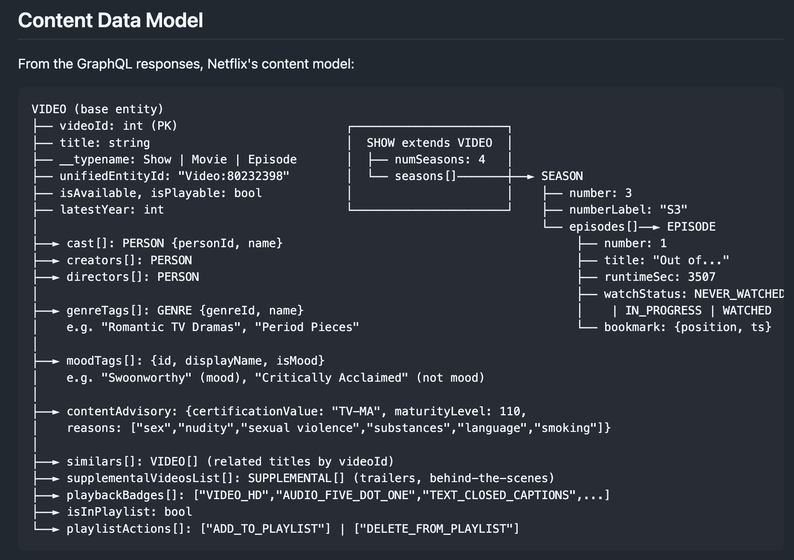
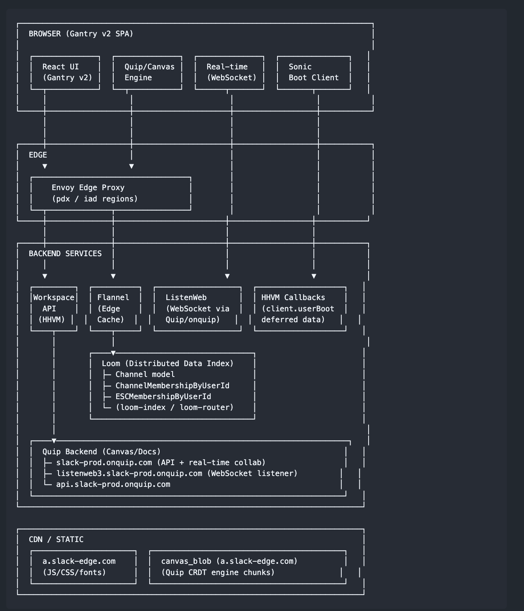

# @ShrivuShankar — Shrivu Shankar

> VP of AI @AbnormalAI

Substack: https://blog.sshh.io/
LinkedIn: https://www.linkedin.com/in/shrivushankar/
Chat: https://sshh.io/coffee-chat  
> Followers: 581. Verified: no.

---

ok decompiling things with opus is actually very addicting

here's apparently how netflix and slack work
- https://gist.github.com/sshh12/dda3a89514f850c459380b18b1f7eb7b
- https://gist.github.com/sshh12/4cca8d6698be3c80e9232b68586b7924

idk maybe wont be that hard to vibe code these after all

> use chrome dev tools to explore <site> and provided a grounded tear down analysis of how the site works

---

*Captured: 2026-03-01T15:12:27.371Z*  
*Source: https://x.com/ShrivuShankar/status/2027910368316821916*
