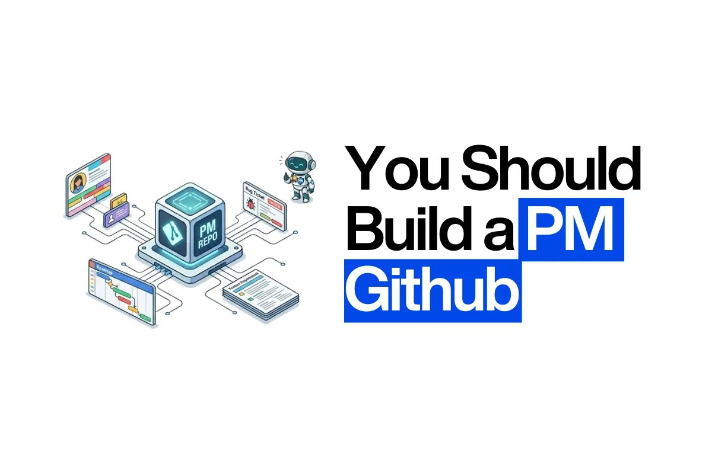

# @aakashgupta — Aakash Gupta

> ✍️ http://product-growth.com: $68K/m 💼 https://www.aibyaakash.com/: $39K/m 🤝 http://landpmjob.com: $35K/m 🎙️ http://www.youtube.com/@growproduct: $25K/m  
> Followers: 191.5K. Verified: no.

---

Two opposite movements are happening in tech hiring right now and they're converging on the same point.

Engineers are building portfolios. After mass layoffs in 2023-2024, senior engineers realized that a resume listing "Led architecture for payments platform" doesn't differentiate when 500 other laid-off engineers say the same thing. So they started building personal sites, writing blog posts, and creating case studies. They borrowed the PM playbook: show your thinking, not just your output.

PMs are building GitHubs. After watching AI transform every PM interview from "describe your process" to "show me what you've built," PMs realized that a resume listing "Launched feature that increased retention 15%" doesn't differentiate when the interviewer wants to see you actually ship something technical. So they started building repos, committing code with AI tools, and contributing to open source. They borrowed the engineering playbook: show working output, not just your thinking.

Both groups are converging on the same insight: proof of work beats proof of credentials. A GitHub repo with a working feedback clustering tool tells a hiring manager more about a PM than a bullet point about "leveraging data to drive product decisions." A portfolio case study showing an engineer's architectural reasoning tells a hiring manager more than a line about "designed scalable systems."

The PMs who figure this out fastest have a two-year head start. 24% have a GitHub today. That number will be 60%+ by 2028. The early movers get the differentiation. The late movers get table stakes.

---

> **Quoting @aakashgupta:**
> Only 24% of PM candidates have a GitHub.
> 
> Every PM I placed at OpenAI, Anthropic, Meta AI last year had one.
> 
> I wrote the first guide on how to build yours:
> 
> https://www.news.aakashg.com/p/you-should-build-a-pm-github
>
> 

---

*Captured: 2026-03-01T15:45:38.339Z*  
*Source: https://x.com/aakashgupta/status/2028049607125774582*
