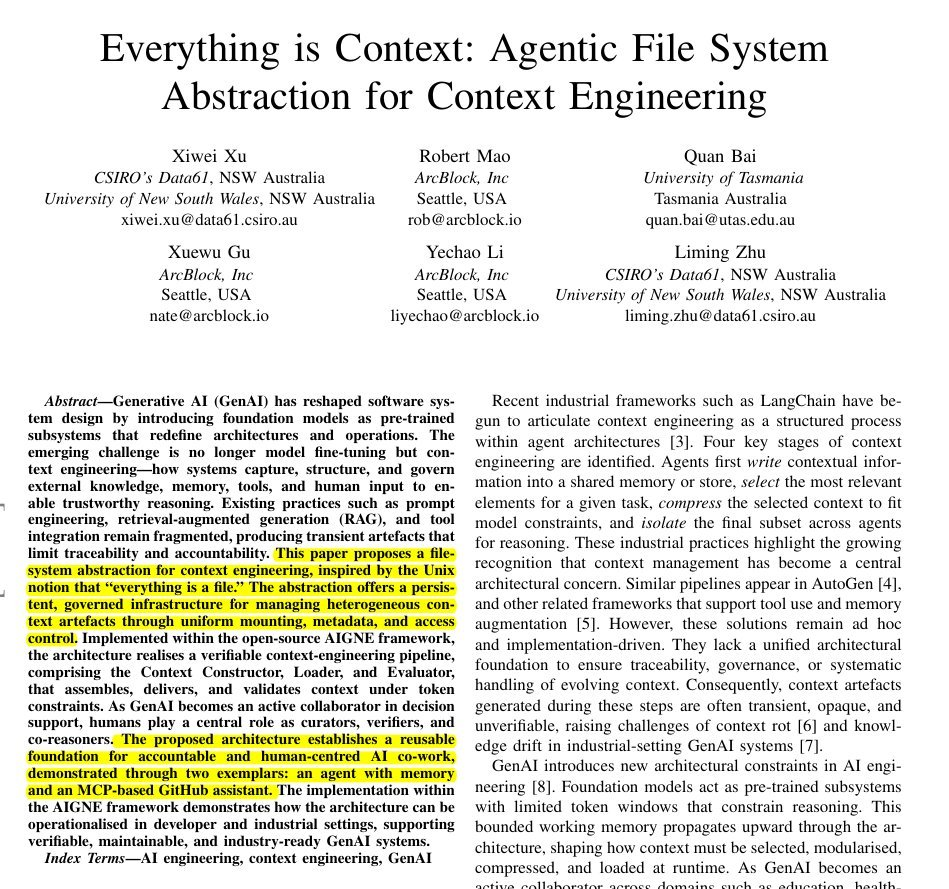

# @rohanpaul_ai — Rohan Paul

> Compiling in real-time, the race towards AGI.

The Largest Show on X for AI.

🗞️ Get my daily AI analysis newsletter to your email  👉 https://www.rohan-paul.com  
> Followers: 137.8K. Verified: no.

---

The paper says the best way to manage AI context is to treat everything like a file system.

Today, a model's knowledge sits in separate prompts, databases, tools, and logs, so context engineering pulls this into a coherent system.

The paper proposes an agentic file system where every memory, tool, external source, and human note appears as a file in a shared space.

A persistent context repository separates raw history, long term memory, and short lived scratchpads, so the model's prompt holds only the slice needed right now.

Every access and transformation is logged with timestamps and provenance, giving a trail for how information, tools, and human feedback shaped an answer.

Because large language models see only limited context each call and forget past ones, the architecture adds a constructor to shrink context, an updater to swap pieces, and an evaluator to check answers and update memory.

All of this is implemented in the AIGNE framework, where agents remember past conversations and call services like GitHub through the same file style interface, turning scattered prompts into a reusable context layer.

----

Paper Link – arxiv. org/abs/2512.05470

Paper Title: "Everything is Context: Agentic File System Abstraction for Context Engineering"

---

*Captured: 2026-03-02T04:57:09.610Z*  
*Source: https://x.com/rohanpaul_ai/status/2028184543040270769*
