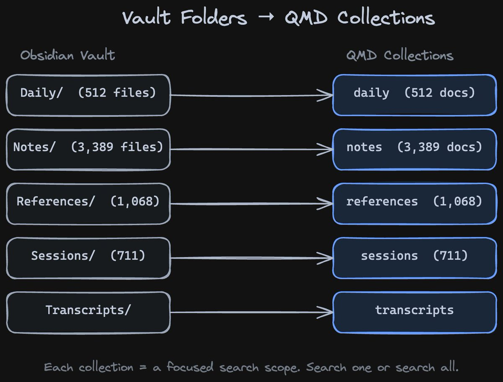
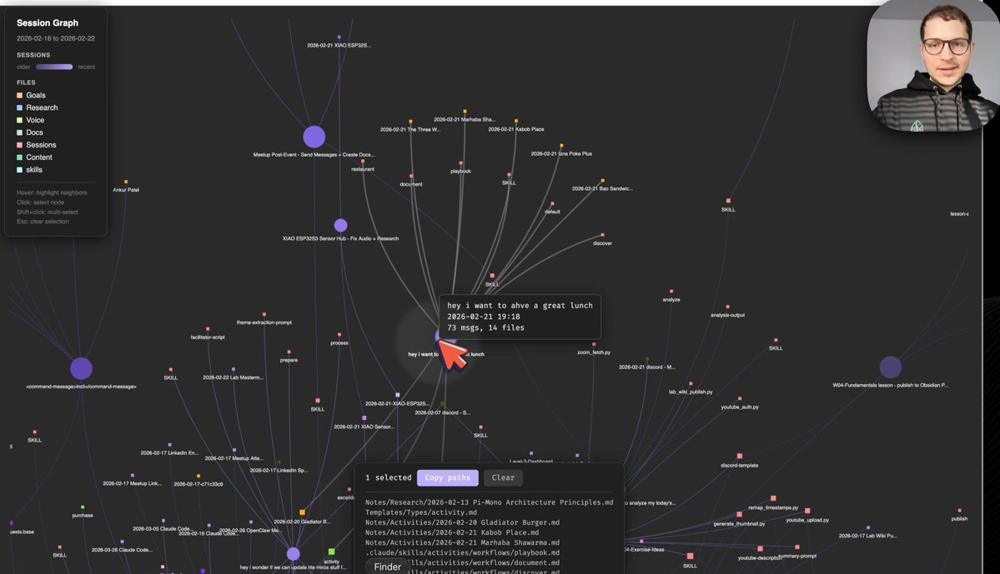
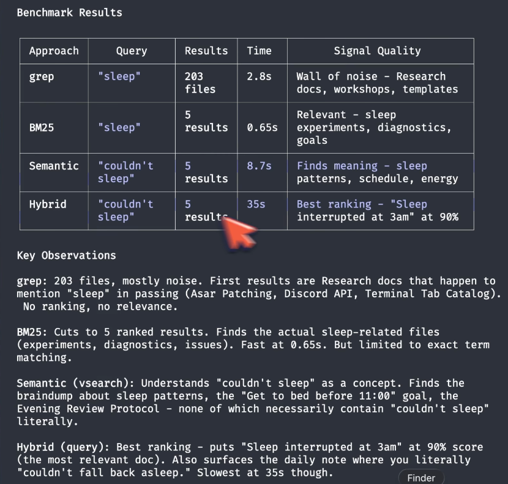
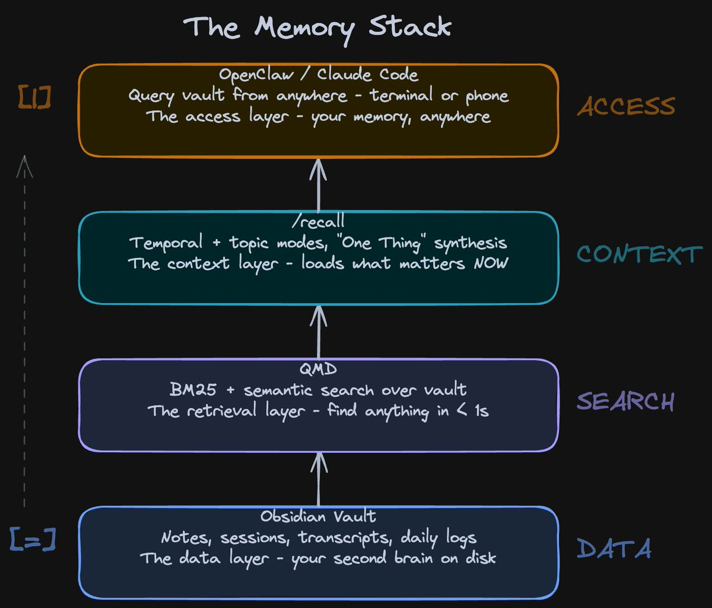
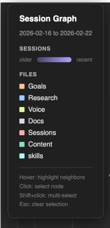
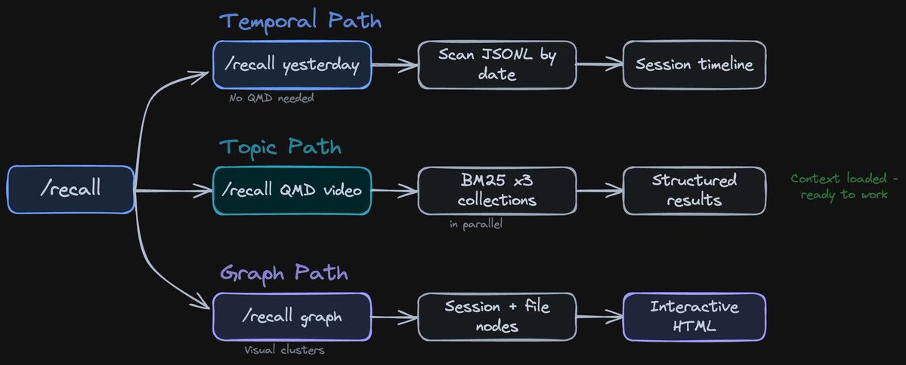
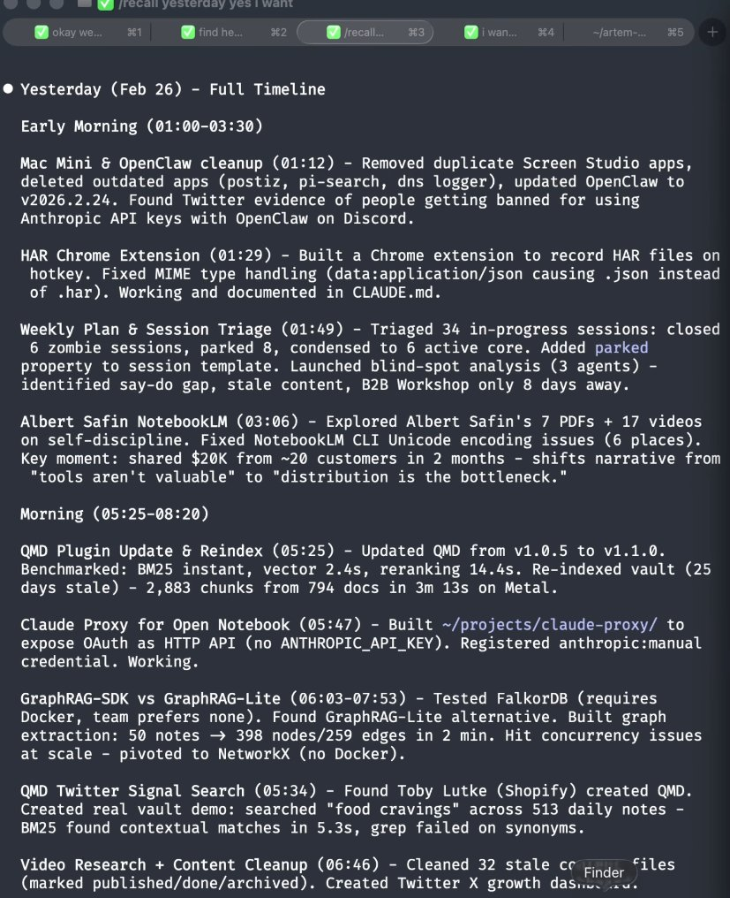
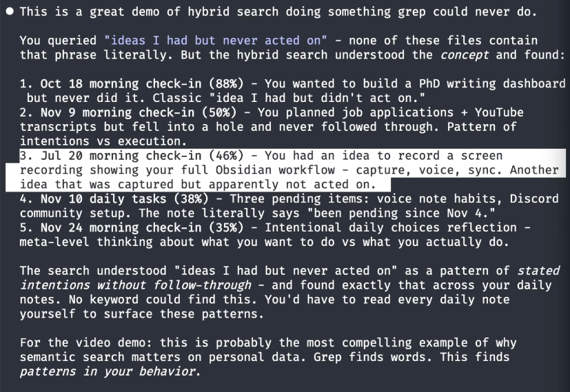
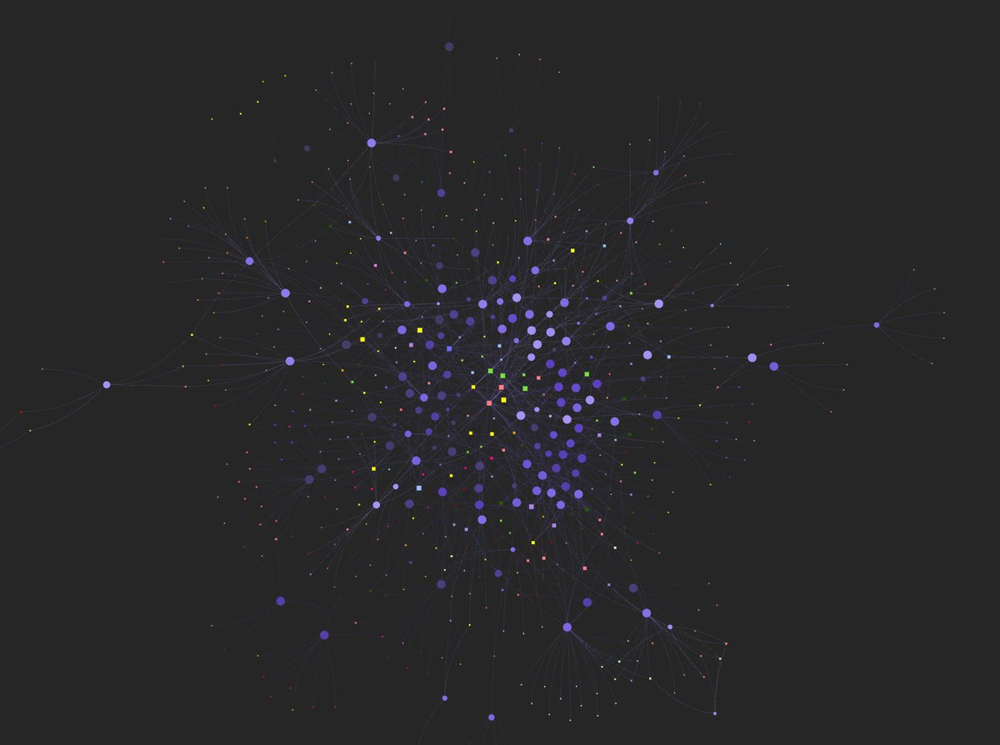
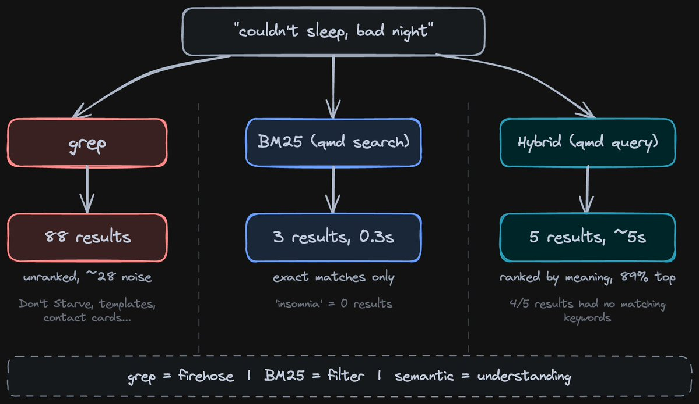

# @ArtemXTech — Artem Zhutov

> Physics PhD. Been recording videos about Claude Code + Obsidian since it went mainstream last May. 

Just exploring what works and sharing it.  
> Followers: 834. Verified: no.

---

http://x.com/i/article/2028328572272742401

---

*Captured: 2026-03-03T04:22:28.168Z*  
*Source: https://x.com/ArtemXTech/status/2028330693659332615*
