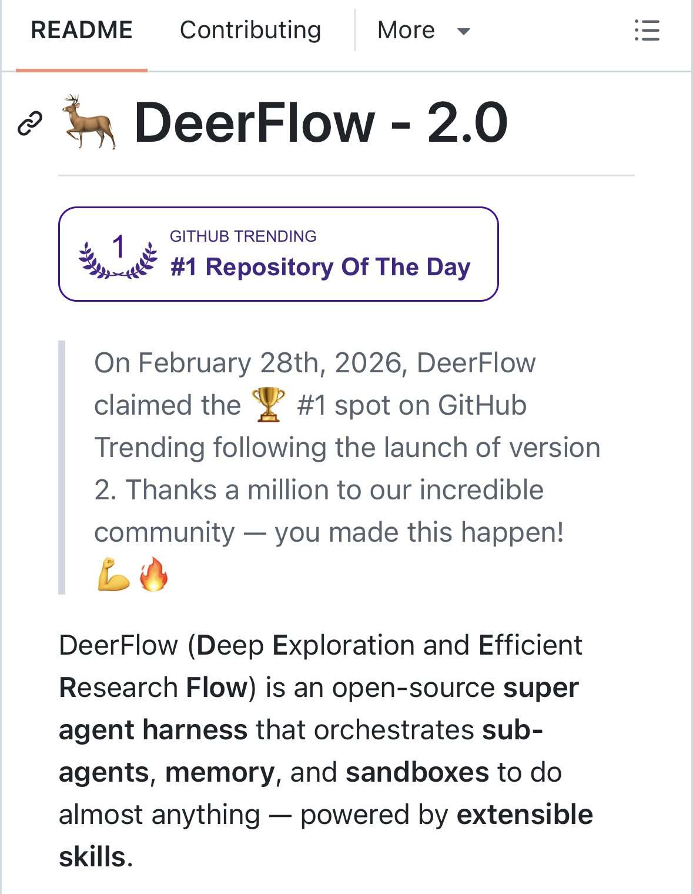

# @GithubProjects — GitHub Projects Community

> We're sharing/showcasing best of @github projects/repos. Follow to stay in loop. Promoting Open-Source Contributions. UNOFFICIAL, but followed by github  
> Followers: 303.9K. Verified: no.

---

## Thread (2 tweets)

**[1/2]** An open-source superagent harness that researches, codes, and creates

---

**[2/2]** https://www.opensourceprojects.dev/post/97907f2f-4f80-40c2-b339-b20f8b28b0f2

---

*Captured: 2026-03-04T04:12:24.365Z*  
*Source: https://x.com/GithubProjects/status/2028734644867547263*
