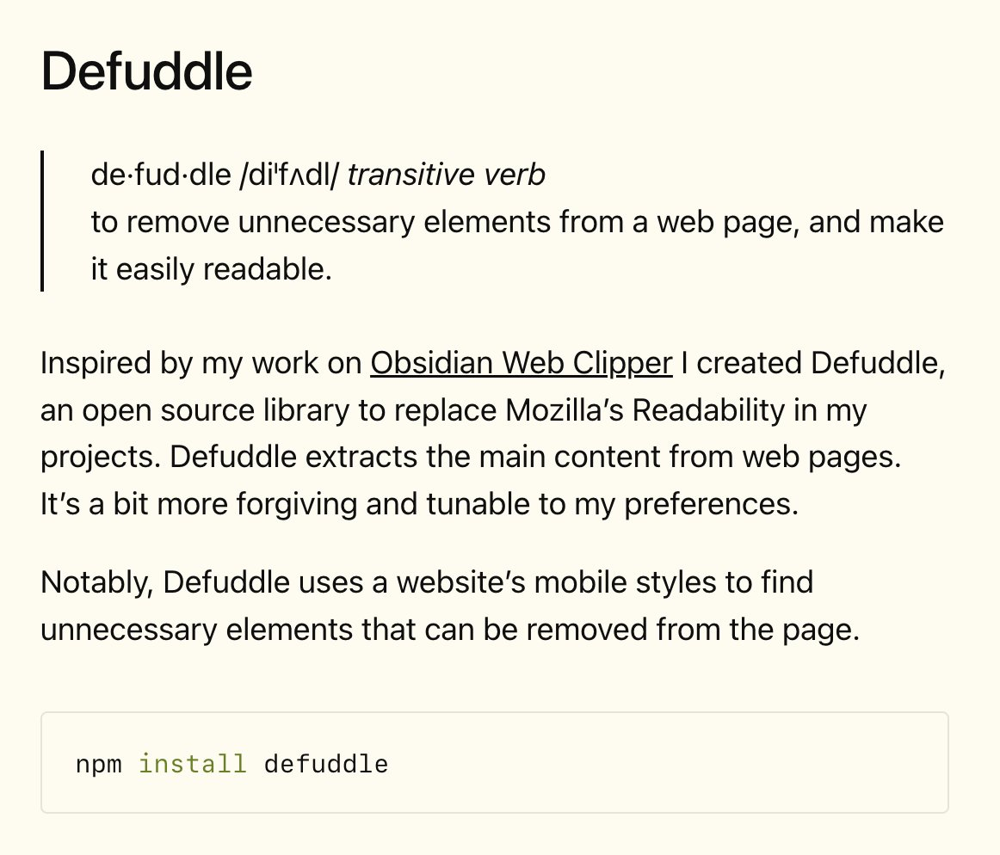

# @kepano — kepano

> making @obsdmd  
> Followers: 89.6K. Verified: no.

---

Defuddle now has a website!

This means you can use Defuddle anywhere to get the main content of a page in Markdown format. 

You can simply add "defuddle.md" before any URL, use it via curl, Skills, CLI, or add it to your app via NPM.
https://x.com/kepano/status/1896716075250675721

> **Note:** This tweet contains a video — not captured. View at source URL.

---

> **Quoting @kepano:**
> new project — defuddle
> 
> > de·​fud·dle /diˈfʌdl/ transitive verb
> > to remove unnecessary elements from a web page, and make it easily readable.
> 
> Inspired by my work on Obsidian Web Clipper I created Defuddle, an open source library to replace Mozilla's Readability in my projects. Defuddle extracts the main content from web pages. It's a bit more forgiving and tunable to my preferences.
> 
> Notably, Defuddle uses a website's mobile styles to find unnecessary elements that can be removed from the page.
> 
> still a work in progress but you can try it out in Obsidian Web Clipper 0.10.9, or install it via NPM
>
> 

---

*Captured: 2026-03-04T04:11:19.662Z*  
*Source: https://x.com/kepano/status/2028849157847617786*
