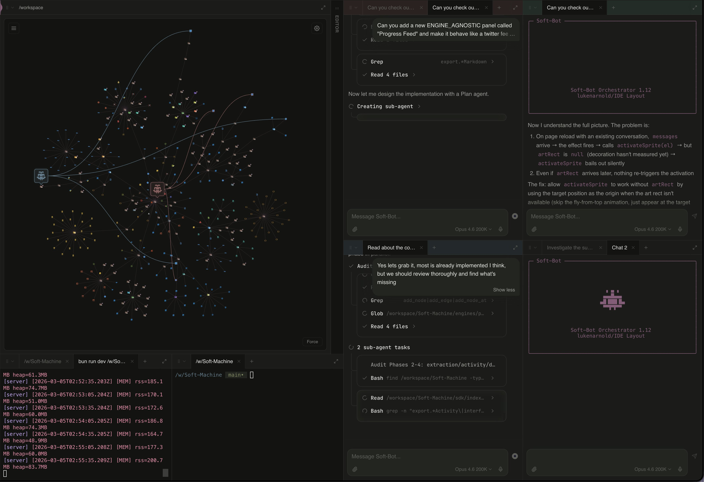

# @lukalotl — luka

> @softmachineio, @vivariumsf  
> Followers: 2.4K. Verified: no.

---

## Thread (3 tweets)

**[1/3]** agent map for viewing all agents and the subagents they're using live across the codebase in soft-machine

---

**[2/3]** @leonardokoomen it's completely changing how I'm able to work

---

**[3/3]** @perceivn thank you!

---

*Captured: 2026-03-06T00:55:28.711Z*  
*Source: https://x.com/lukalotl/status/2029390577645785498*
