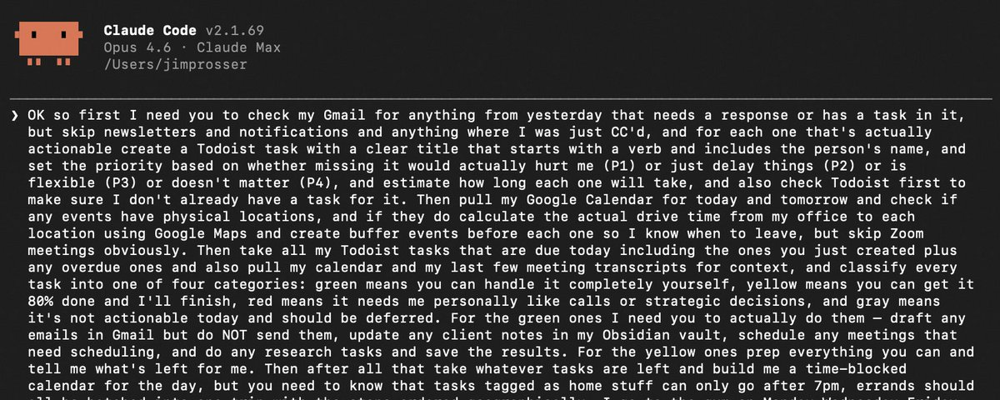
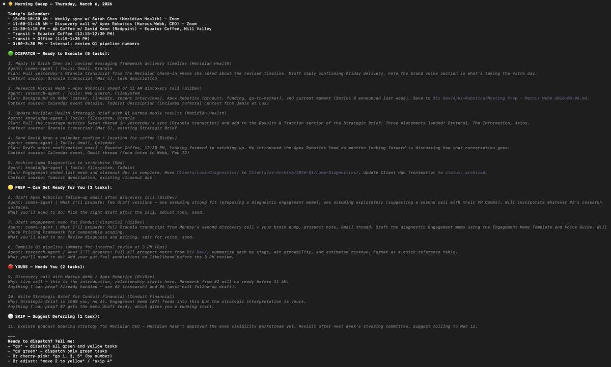

# @thejayden — Jayden ⛩️

> Full time DEV | DM for biz
@PolyInsiderBot & @mementorbot & @KOLme_fun  
> Followers: 12.5K. Verified: no.

---

I often don’t share this kind of thing because it’s usually AI slop.

But this article about building a Chief of Staff with Claude Code is one of the best real examples of agentic systems I’ve seen.

---

> **Quoting @jimprosser:**
> http://x.com/i/article/2029698920159531010
>
> 
> 

---

*Captured: 2026-03-07T00:31:54.999Z*  
*Source: https://x.com/thejayden/status/2029899328400109732*
