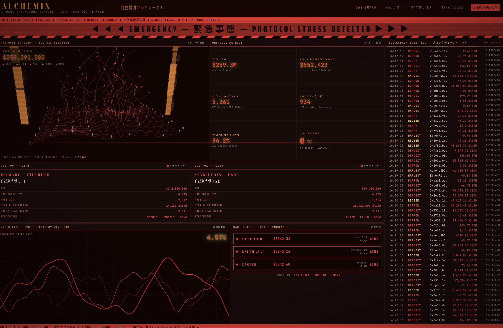

# @scupytrooples — scoopy trooples

> @AlchemixFi 錬金術師  breaker of chains  
> Followers: 108.0K. Verified: no.

---

the weebs and snooty deisgncels were hating so hard it motivated me to make it better

refined the look, added threejs eve-like visualizations (and the pretty stuff is programmable for actual data), fixed the type face. same repo as before.

---

> **Quoting @scupytrooples:**
> recently rewatched Evangelion and decided to go ahead and build out the visual style into a web ui design skill pack for claude/openclaw (link to git in next post)
>
> 

---

*Captured: 2026-03-11T05:35:33.406Z*  
*Source: https://x.com/scupytrooples/status/2031284966961852569*
