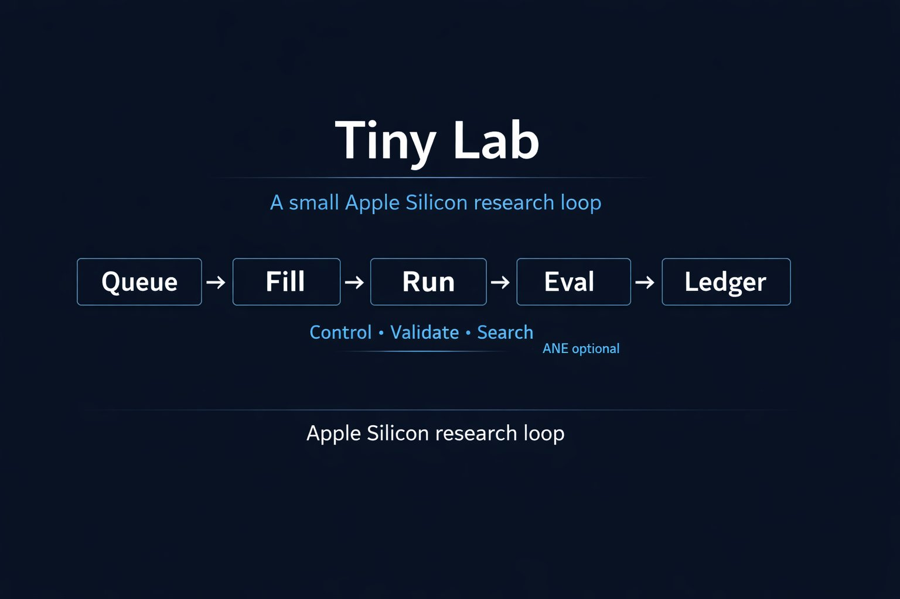

# @TrevinPeterson — Trevin Peterson

> Bio unavailable.  
> Followers: 476. Verified: no.

---

## Thread (3 tweets)

**[1/3]** On Friday @karpathy released Auto Research — one agent, one GPU, one file. I forked it for Apple Silicon over the weekend. Now I'm releasing Tiny-Lab — the control plane that turns your Mac cluster into a research lab. Launch, crash-recover, evaluate, promote winners, kill losers, log everything. You sleep, it does science.
https://github.com/trevin-creator/Tiny-Lab

---

**[2/3]** @NobyDefault @karpathy yeah most of the code would be reusable. It might take a few hours for codex to plow through it and fork it but it's very doable. Just give codex the read me and ask

---

**[3/3]** @TechWithMatteo @karpathy Even one it can be helpful if you can get ANE working.

---

*Captured: 2026-03-11T05:42:54.982Z*  
*Source: https://x.com/TrevinPeterson/status/2031478430752190612*
