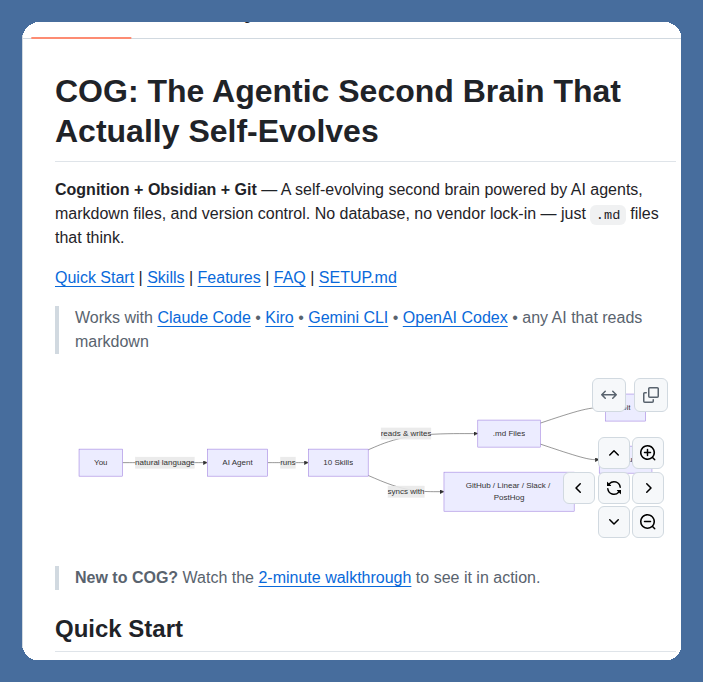

# @tom_doerr — Tom Dörr

> Follow for posts about GitHub repos, DSPy, and agents
Subscribe for top posts
DM to share your AI project (Due to volume of DMs I'll prioritize subscribers)  
> Followers: 187.3K. Verified: no.

---

AI agents managing markdown files for knowledge and version control

https://github.com/huytieu/COG-second-brain

---

*Captured: 2026-03-11T23:21:48.534Z*  
*Source: https://x.com/tom_doerr/status/2031521327807357370*
