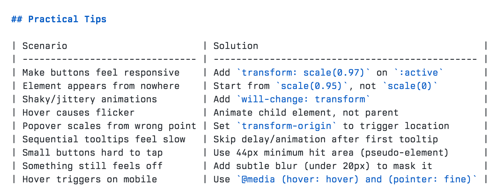

# @emilkowalski — Emil Kowalski

> Currently @Linear,  https://animations.dev/  
> Followers: 60.6K. Verified: no.

---

Some tips from the http://animations.dev skill file that you can feed to your favorite coding agents.

---

*Captured: 2026-03-11T22:52:08.613Z*  
*Source: https://x.com/emilkowalski/status/2031742178297335879*
