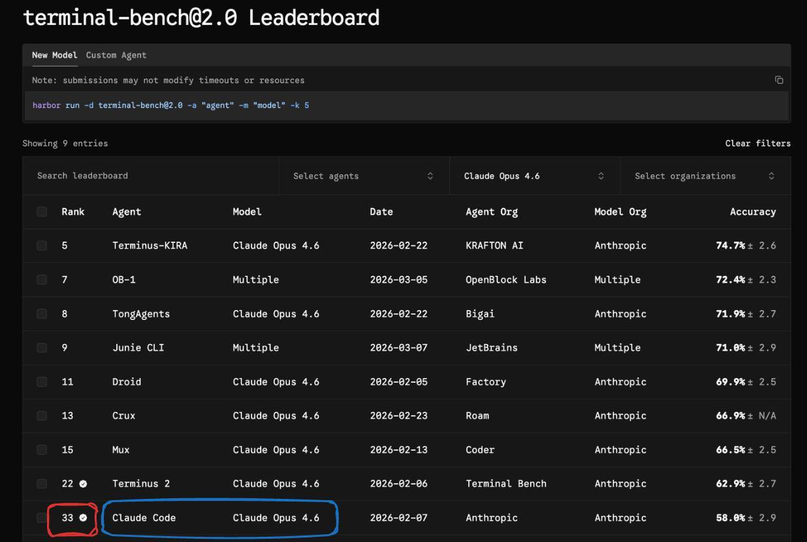

# @yishan — Yishan

> I run Terraformation, and I was once the CEO of Reddit. Both are very interesting challenges.

AMA in a subscriber-only newsletter! https://AskYishan.com/  
> Followers: 105.7K. Verified: no.

---

Yeah I switched over to http://pi.dev for my harness (still using Opus 4.6) and it’s been performing much better.

---

> **Quoting @himanshustwts:**
> If you are Claud Code/Opus 4.6-pilled, this might sounds crazy to you but CC is worst harness for Opus 4.6 with accuracy of 58%
> 
> Thank you for your attention to this matter.
>
> 

---

*Captured: 2026-03-12T16:49:28.681Z*  
*Source: https://x.com/yishan/status/2032035749491782121*
